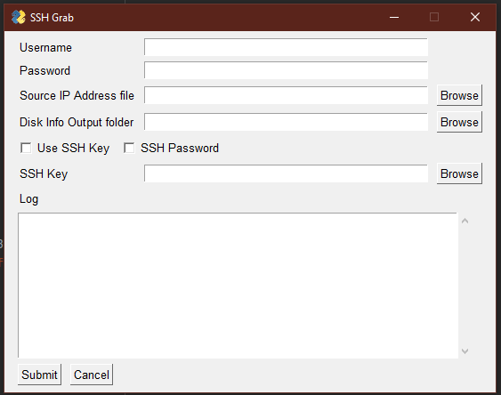

# ssh_grab

This is a GUI based SSH client to grab disk information from Linux hosts in an environment. The aim being to qickly gather this information.

It is written in Python and uses:

- paramiko
- xlsxwriter
- PySimpleGUI

Note that though there is a dedicated ssh key and ssh password checkbox they are only needed if your key is not in the 
usual .ssh directory. Paramiko is clever is that is will always check the keys listed there before using the username
and password. 

The app does work but there is still a lot to do.