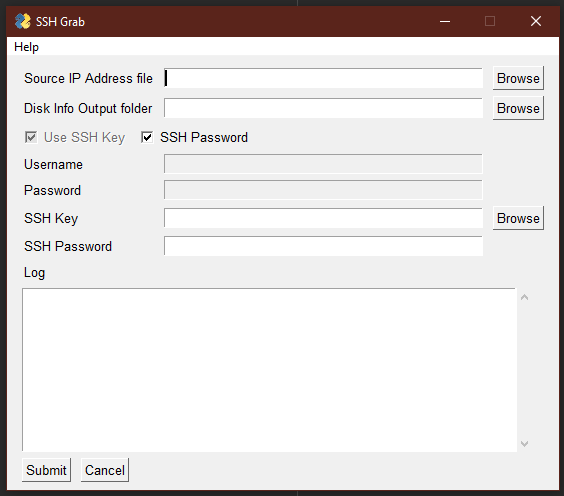

# ssh_grab

This is a GUI based SSH client to grab disk information from Linux hosts in an environment. The aim being to quickly gather this information.
All you need to do is put all the IP addresses for all the systems in a text file, one per-line and ssh_grab will loop through them and output
them to an excel file.

It is written in Python 3.8 and uses:

- paramiko
- xlsxwriter
- PySimpleGUI

The tools simple to use, simply add all the Linux server IP addresses to a text file, on per-line and select that file in
the GUI. Next specify where you would like the output Excel file to be saved. You then need to specify the credentials
you wish to use which can be:

- Username and password
- SSH Key alone
- SSH Key with password

You will need to specify the location of the SSH key before progressing, note that if you use OpenSSH it is likely that
the file will be saved in the /Users/User_name/.ssh folder.

Logging is enabled in ssh_grab so you will find a issues.log file in the root of the directory when you run it to see
what is going on. This is set to DEBUG mode (level=logging.DEBUG), if you want to reduce this log level just remove that
string and it will go back to the default WARNING level.
